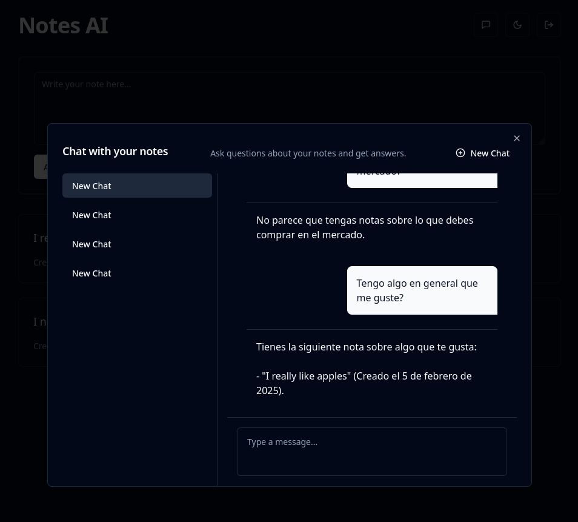
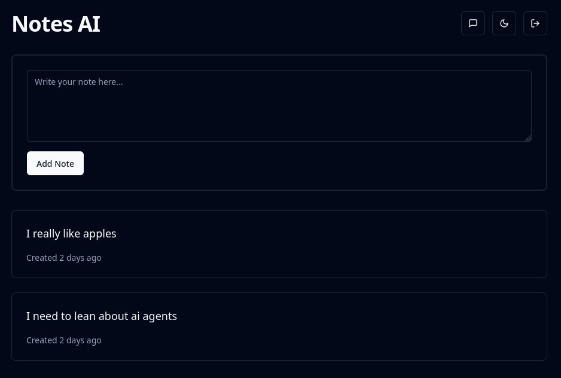

# Notes AI Agent 🤖📝

An intelligent note-taking companion with AI-powered insights.

## Features ✨

- **AI-Powered Insights** - Get automatic suggestions and summaries
- **RAG and SQL Generation** - Generate insights from your notes
- **Secure Authentication** - Powered by Supabase Auth
- **Real-Time Chat** - Integrated AI chat interface with message history
- **CRUD Operations** - Full note management capabilities
- **Theme Support** - Dark/light mode with system preference
- **Type Safety** - Full TypeScript integration with Zod validation

## Tech Stack 🛠️

**Frontend**
- React 18 + TypeScript
- Vite + SWC
- TanStack Router
- TanStack Query (React Query)
- Shadcn UI

**[Backend](https://github.com/AloisCRR/notes-ai-agent-api)**
- Supabase
- FastAPI
- PydanticAI

## Installation ⚙️

1. Clone the repository:
```bash
git clone https://github.com/your-username/notes-ai-agent.git
cd notes-ai-agent
```

2. Install dependencies:
```bash
pnpm install
```

3. Set up environment variables (create `.env` file):
```env
VITE_SUPABASE_URL=your-supabase-url
VITE_SUPABASE_ANON_KEY=your-supabase-key
VITE_BACKEND_URL=http://localhost:8000
```

## Running the App 🚀

**Development Mode**
```bash
pnpm dev
```

**Production Build**
```bash
pnpm build && pnpm preview
```

## Project Structure 📂

```tree
src/
├── components/       # UI components (shadcn)
├── pages/            # Application views
├── backend/
│   ├── fastapi/      # Auto-generated API client
│   └── supabase/     # Supabase integration
├── routes/           # TanStack Router configuration
├── lib/              # Utilities and hooks
└── main.tsx          # Application entry point
```

## API Documentation 📚

The API follows OpenAPI 3.0 specification. The client is generated using a VS Code task: `generate-api-client`. You need to have the `openapi-generator-cli` installed.

This creates TypeScript types and API clients in `src/backend/fastapi`.

To update Supabase types, run the `generate-supabase-types` task.

## Application Showcase 🖼️

### Notes AI Chat Interface


### Basic Notes UI


# TODO
- [ ] Markdown support
- [ ] Mobile friendly
